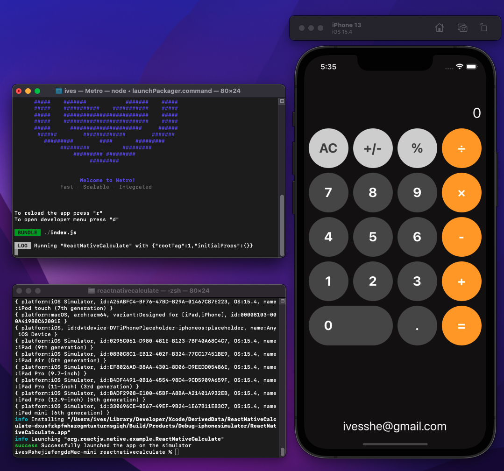

# React Native 計算機

# 使用技術

- react
- react-native

# 使用設備及環境

- Mac mini M1
- macOS Monterey 12.2.1
- node 16.10.0

# 頁面展示




# 影片展示

https://youtu.be/OpfdAnE0Lq4

# 參考項目

https://github.com/IvesShe/ReactNative_Note

https://github.com/IvesShe/ReactNative_TxClass

# 運行

```bash
npx react-native run-ios
```

# 官網安裝參考

https://reactnative.cn/docs/environment-setup

